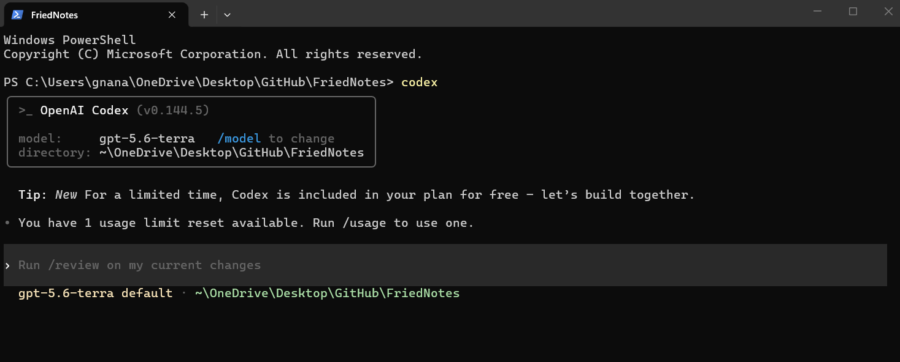

# OpenAI Codex in the terminal

This guide explains how to install and use OpenAI Codex from the terminal.



------------------------------------------------------------------------

> Note: To use OpenAI Codex in the terminal, you need an active OpenAI subscription that includes access to Codex features. If you use API key authentication, make sure your OpenAI account has API access enabled.

## Prerequisites

Before you begin, make sure that you have:

- Git installed.
- Node.js installed.
- A GitHub account.
- An OpenAI account or API key.
- A project folder.

Verify your tools:

```bash
git --version

node --version