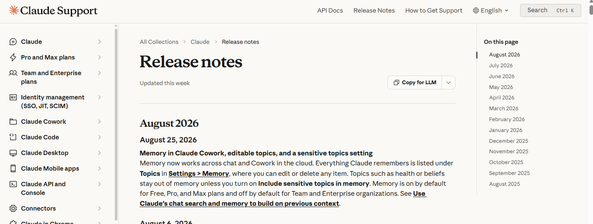
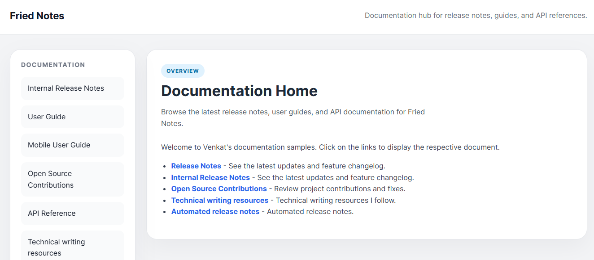

## Migration of the CMS from Jelly to new layout

In upcoming releases, the CMS layout will be migrated to a new layout.

The new layout will support Notes and a right-side column on every article page to display headings, improving overall readability and navigation.

Planned date: September

Upcoming UI

Current UI

